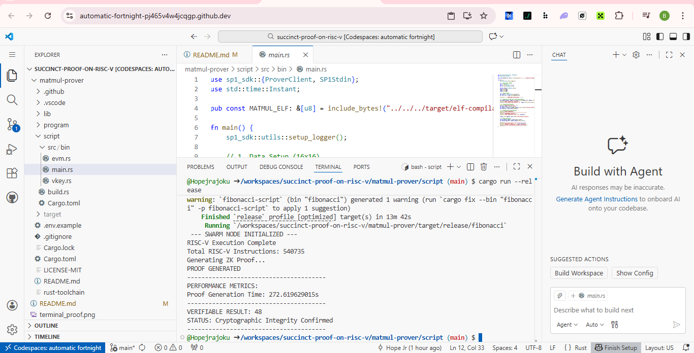

# Succinct Proof on RISC-V (ZK-MatMul)

This project implements **Verifiable Compute** for decentralized AI swarms. Using **SP1 (Succinct Prover 1)** and a **RISC-V zkVM**, we prove that matrix multiplication was performed correctly without requiring the verifier to re-run the computation.

## The Vision
In a decentralized "Swarm" of AI agents, nodes must perform heavy mathematical lifting (like Matrix Multiplication for Neural Networks). Traditionally, you have to trust the node or re-run the math. **ZK-MatMul** changes this: Nodes provide a result PLUS a cryptographic "receipt" (proof) that confirms the result is 100% accurate according to the source code.

## Proof of Execution

*Figure 1: Successful ZK Proof generation and verification on RISC-V.*

## Performance Logs (Verified Run)
- **Target**: 16x16 Matrix Multiplication.
- **RISC-V Instructions**: 540,735 cycles.
- **Proof Generation Time**: 275.80 seconds.
- **Verifiable Result**: 48.0 (Example Output).
- **Integrity**: **Cryptographically Verified**

## Tech Stack
- **Guest Program**: Rust-based MatMul compiled to **RISC-V**.
- **Prover**: SP1 zkVM (STARK-based).
- **Host**: Rust SDK for proof generation and verification.
- **Environment**: GitHub Codespaces.

## HOW TO RUN
# a. Launch the Environment
Click the Code button at the top of this repository.
Select the Codespaces tab and click Create codespace on main.
Wait for the terminal to initialize and AUTO install packages, to save you the stress(approx. 30-90 seconds).

# b. 
1. **Build Guest**: `cd matmul-prover/script`
2. **Run Prover**: `cargo run --release`

---

### Judge/Contributor Tip: Instant Environment
This repository includes a `.devcontainer` configuration. If you open this project in **GitHub Codespaces**, the Rust toolchain and SP1 RISC-V environment will be installed automatically, allowing you to run the prover immediately without manual setup.
